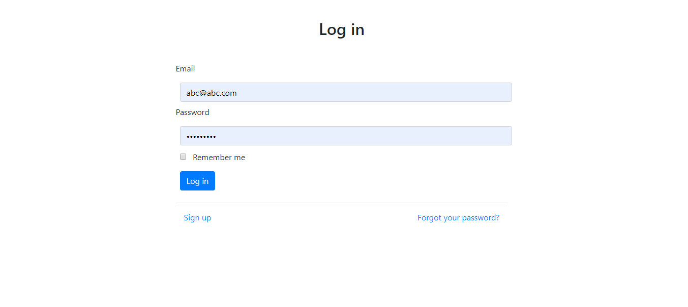
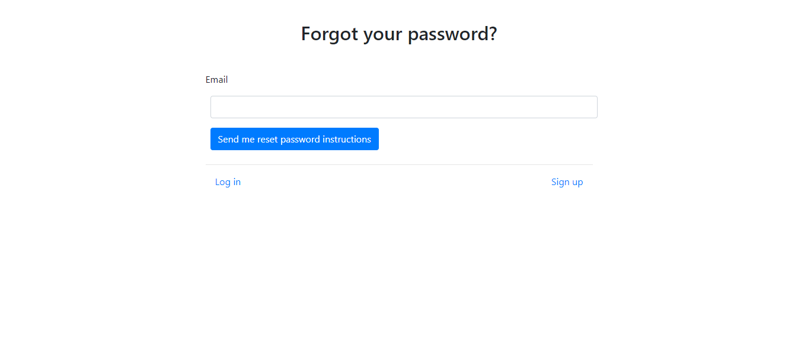
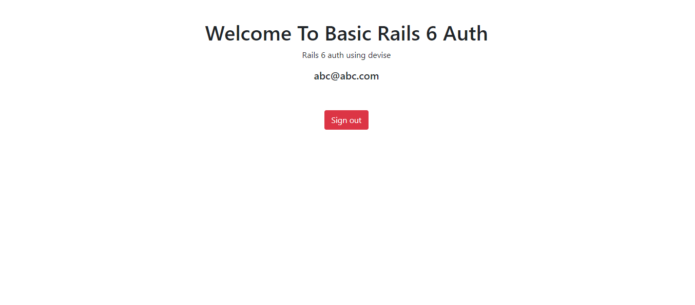

# Rails 6 devise example
It is an example app and a basic template for devise auth in rails 6 with omni github auth.

## Build with
- Ruby on Rails
- Bootstrap with Webpack
- Github OAuth

## Get Started
### Requirements
- Ruby 2.6
- Rails 6
- Foreman gem

### Clone
```bash
git clone https://github.com/imhta/rails_6_devise_example.git
cd rails_6_devise_example
```
### Install and migrate db

```bash
bundle install
yarn install --check-files
rails db:migrate
```
### Start Server
To start rails server
```bash
rails server

```
To start webpack server (rails 6 default is to use webpack)
```bash
gem install foreman
foreman start -f Procfile.dev
```


## Screenshots

### Log In Page


### Sign Up Page


### Forgot password Page


### Home Page



## Useful links
- [How to Redirect to a specific page on successful sign in](https://github.com/plataformatec/devise/wiki/How-To:-redirect-to-a-specific-page-on-successful-sign-in)
- [How to use custom mailer](https://github.com/plataformatec/devise/wiki/How-To:-Use-custom-mailer)
- [The Figaro Gem: an easier way to securely configure Rails applications](https://medium.com/@MinimalGhost/the-figaro-gem-an-easier-way-to-securely-configure-rails-applications-c6f963b7e993)
- [OAuth with digital ocean in devise](https://www.digitalocean.com/community/tutorials/how-to-configure-devise-and-omniauth-for-your-rails-application)
- [Omni Auth: overview](https://github.com/plataformatec/devise/wiki/OmniAuth:-Overview)
- [Other Devise Examples](https://github.com/plataformatec/devise/wiki/Example-applications)
### Common Error
- [undefined method devise for in rails](https://stackoverflow.com/questions/4810941/undefined-method-devise-for-in-rails)
